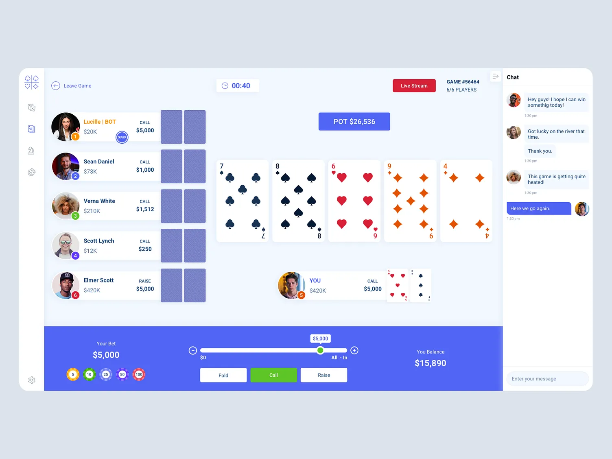

# 4AM Casino

Open-source no-limit Texas Hold'em for friend groups where **nobody can see a card they
shouldn't — not even the person hosting the server**.

Instead of trusting a server to deal, every player's browser takes part in a
[mental poker](https://en.wikipedia.org/wiki/Mental_poker) protocol: the deck is encoded as
points on the ristretto255 curve, each player masks and shuffles it with a secret per-hand key,
and every card is opened only by the cooperation of all players. The server coordinates
messages and enforces betting rules, but it never holds a masking key and never learns a hole
card.

Chips are play money. Players buy points from a **bank**; the room's **banker** approves each
purchase, and every movement — purchases and per-hand settlements — is written to an
append-only, **hash-chained ledger** the whole room can verify, so the group can settle up
outside the app. No real payments, ever.



## How the cards stay secret

- **Shuffle**: each hand, every player in turn multiplies all 52 card points by a secret key
  and permutes them. After all players have gone, the deck's order is unknown to everyone.
- **Key commitments + DLEQ proofs**: each player publishes a commitment to their hand key, and
  every unmask they ever send carries a Chaum–Pedersen proof it used exactly that key. A wrong
  share is rejected and attributed the moment it arrives — and a showdown reveal cannot claim a
  different card than the one dealt.
- **Dealing**: to give you a hole card, all *other* players apply their proven unmasks; you
  apply yours last, locally. Observers see a point still masked by your key.
- **Transcripts**: every protocol message is signed (ed25519) and folded into a hash chain.
  Completed hands are stored and downloadable for offline audit. Rooms can opt into
  `strict-audit` mode, where everyone reveals their hand key after each hand so the entire
  shuffle can be re-verified (at the cost of folded cards becoming public afterwards).
- **Honest about limits**: a malicious *shuffle* is detected and attributed (at open time or on
  key reveal), not cryptographically prevented — that trade keeps the protocol simple enough
  for a friends game. Out-of-band collusion (screen sharing) is out of scope, as it is for
  every protocol. See `docs/superpowers/specs/` for the full threat model.

## Running it

Requires Node 22+.

```bash
npm install

# development (two terminals)
npm run dev --workspace @4am/server   # API + WebSocket on :8787
npm run dev --workspace @4am/web      # Vite dev server on :5173 (proxies to :8787)

# self-host (one process serves everything)
npm run build --workspace @4am/web
npm run start --workspace @4am/server # serves the built app + API + WS on :8787
```

State lives in a single SQLite file (`DB_PATH`, default `./4amcasino.db`). Set `PORT` to change
the port. Create an account, create a room, share the 6-letter code, buy points, and deal.

Your password never leaves the browser: the client derives a login key and a separate signing
identity from it with domain-separated scrypt, so the server can authenticate you but can never
sign or decrypt as you.

## Repository layout

```
packages/shared        cards, hand evaluator, betting engine, WS message schemas
packages/mental-poker  the crypto: group ops, shuffle/unmask, DLEQ proofs, transcripts
apps/server            Fastify + ws + SQLite: auth, rooms, bank/ledger, hand orchestration
apps/web               React (Feature-Sliced Design) + Tailwind client
docs/                  design spec, implementation plans, UI reference
```

`npm test` runs the whole suite, including an end-to-end test where simulated clients play
complete hands over WebSocket with the real cryptography.

## License

MIT — see [LICENSE](LICENSE).
