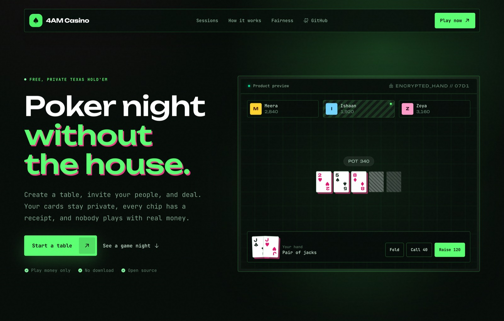
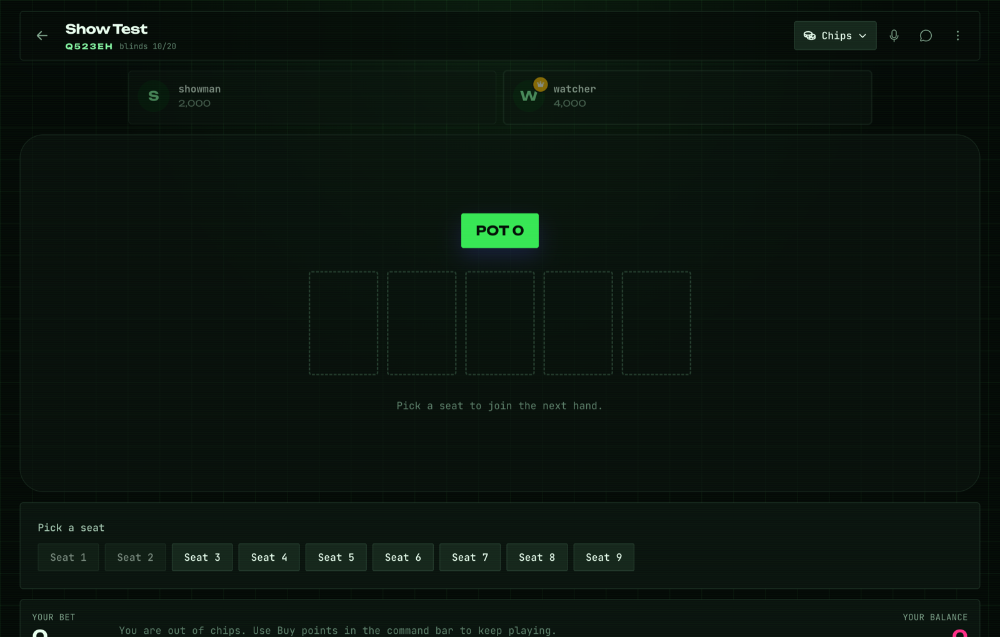
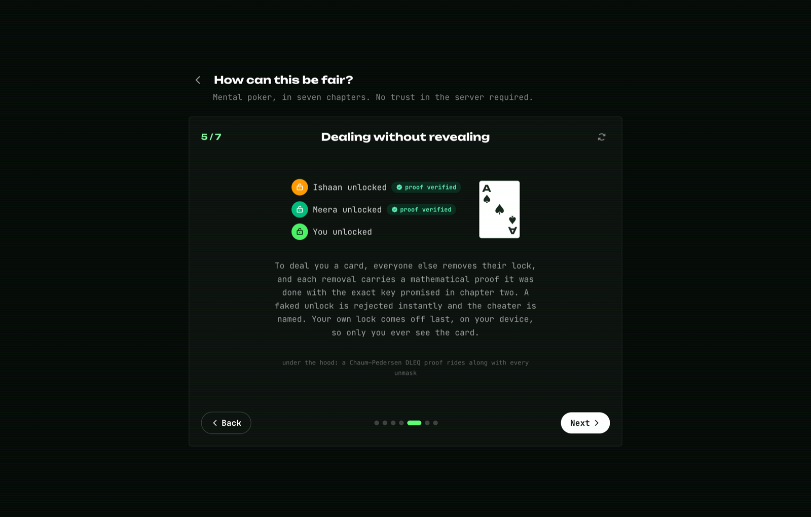

# 4AM Casino

**Provably-fair Texas Hold'em for friend groups. Nobody sees a card they shouldn't — not even the server.**

[**Play it live →**](https://poker.notpritam.in) · [How it's fair (60s animated tour)](https://poker.notpritam.in/fair) · [Give an AI a seat](apps/mcp/README.md) · [MIT licensed](LICENSE)



Instead of trusting a server to deal, every player's browser takes part in a
[mental poker](https://en.wikipedia.org/wiki/Mental_poker) protocol: the deck is encoded as
points on the ristretto255 curve, each player masks and shuffles it with a secret per-hand key,
and every card is opened only by the cooperation of all players. The server coordinates
messages and enforces betting rules, but it never holds a masking key and never learns a hole
card.

Chips are play money. Players buy points from a **bank**; the room's **banker** approves each
purchase, and every chip movement — buys, pots, bounties, transfers — lands in an append-only,
**hash-chained ledger** the whole room can verify, so the group settles up outside the app.
No real payments, ever.

| The table | The fairness tour |
| --- | --- |
|  |  |

## What's inside

**The game.** No-limit Hold'em with a turn timer the banker picks (15s to no-limit),
one-tap quick bets and pre-selected actions so you never stall the table, auto-deal when the
banker is online, winner-reveal choreography with plain-English reasoning for why the hand won,
full hand replays rebuilt from the signed game record, sit-out, four card-back colorways and a
4-color deck option, and three themes — the default cyberpunk terminal look, plus light and
dark.

**The people.** Friends with live presence, table invites (with an opt-in auto-join), public
tables listed in every lobby or private 6-letter codes, watch-only spectator links where
viewers can ask to join and the banker admits them, an attached Meet/Zoom link per table,
voice chat, table chat with your own quick phrases, and reactions.

**The money.** A banker (plus an optional co-banker) approves buy-ins; every movement is
hash-chained. Players can send or lend chips to each other between hands. The banker can revert
a purchase, void a single hand, or void a whole table — voided amounts drop out of everyone's
totals automatically. Rooms can require a minimum number of hands before someone's winnings
count in settle-up. The ledger page renders a full session report: time played, hands, biggest
pot, per-player win/loss bars, and who owes whom.

**The bragging rights.** Global and in-room leaderboards with a chip-leader crown, a cumulative
winnings chart in the lobby, a play-style radar mined from your actual hand transcripts
(loose/aggressive/pressure/showdowns/wins, plus an archetype: shark, rock, maniac, calling
station...), one-tap shareable hand-result images, an optional 7-2 offsuit bounty the banker
can put up, paid peeks at mucked cards (if the owner agrees), and a private mode that hides
your winnings from everyone but the bankers.

**The robots.** [`apps/mcp`](apps/mcp/README.md) ships an MCP server that gives any
MCP-capable agent (Claude Code, Claude Desktop, ...) a real seat: join by code, buy chips,
read the table, act. The headless client runs all the cryptography, so the same fairness
guarantees hold for bots — nobody, not even the server, sees the agent's cards.

## How the cards stay secret

The live app walks through this with animations at
[poker.notpritam.in/fair](https://poker.notpritam.in/fair). The short version:

- **Shuffle**: each hand, every player in turn multiplies all 52 card points by a secret key
  and permutes them. After all players have gone, the deck's order is unknown to everyone.
- **Key commitments + DLEQ proofs**: each player publishes a commitment to their hand key, and
  every unmask they ever send carries a Chaum–Pedersen proof it used exactly that key. A wrong
  share is rejected and attributed the moment it arrives — and a showdown reveal cannot claim a
  different card than the one dealt.
- **Dealing**: to give you a hole card, all *other* players apply their proven unmasks; you
  apply yours last, locally. Observers see a point still masked by your key.
- **Transcripts**: every protocol message is signed (ed25519) and folded into a hash chain.
  Completed hands are stored and downloadable for offline audit. Rooms can opt into
  `strict-audit` mode, where everyone reveals their hand key after each hand so the entire
  shuffle can be re-verified (at the cost of folded cards becoming public afterwards).
- **Honest about limits**: a malicious *shuffle* is detected and attributed (at open time or on
  key reveal), not cryptographically prevented — that trade keeps the protocol simple enough
  for a friends game. Out-of-band collusion (screen sharing) is out of scope, as it is for
  every protocol. See [`docs/superpowers/specs/`](docs/superpowers/specs/) for the full design
  and threat model.

Your password never leaves the browser either: the client derives a login key and a separate
ed25519 signing identity from it with domain-separated scrypt, so the server can authenticate
you but can never sign or decrypt as you.

## Running it

Requires Node 22+.

```bash
npm install

# development (two terminals)
npm run dev --workspace @4am/server   # API + WebSocket on :8787
npm run dev --workspace @4am/web      # Vite dev server on :5173 (proxies to :8787)

# self-host (one process serves everything)
npm run build --workspace @4am/web    # builds the app AND a prebundled server
npm run start --workspace @4am/server # serves the built app + API + WS on :8787
```

State lives in a single SQLite file (`DB_PATH`, default `./4amcasino.db`). Set `PORT` to change
the port. Create an account, create a room, share the 6-letter code, buy points, and deal.

## Hosting

The app is one long-running Node process (HTTP + WebSocket + a SQLite file), so it needs a
host that runs real servers — serverless platforms (Vercel/Netlify functions, GitHub Pages)
can't run it.

**Render:** this repo ships a [`render.yaml`](render.yaml) blueprint. In the Render dashboard
choose **New → Blueprint**, pick this repository, and deploy. On the free tier the service
sleeps after ~15 min idle and storage is ephemeral (the ledger resets on every deploy); the
`starter` plan with the 1 GB disk block gives a persistent ledger, which is how
[poker.notpritam.in](https://poker.notpritam.in) runs. The server also supports an optional
MongoDB snapshot layer (`MONGO_URL`) that continuously backs up and restores the database.

**Docker (any VPS, Fly.io, Railway):**

```bash
docker build -t 4amcasino .
docker run -p 8787:8787 -v 4amcasino-data:/data 4amcasino
```

**Quick game night without hosting at all:** run it locally (`npm run start --workspace
@4am/server`) and share a tunnel, e.g. `npx ngrok http 8787` or a
[Tailscale](https://tailscale.com) address. Friends on the same Wi-Fi can just open
`http://<your-LAN-IP>:8787`.

## Repository layout

```
packages/shared        cards, hand evaluator, betting engine, WS message schemas
packages/mental-poker  the crypto: group ops, shuffle/unmask, DLEQ proofs, transcripts
apps/server            Fastify + ws + SQLite: auth, rooms, bank/ledger, hand orchestration
apps/web               React (Feature-Sliced Design) + Tailwind v4 client, three themes
apps/mcp               MCP server + headless client: an AI seat at the table
docs/                  design spec, implementation plans, screenshots, UI reference
```

`npm test` runs the whole suite (100+ tests), including an end-to-end test where simulated
clients play complete hands over WebSocket with the real cryptography, and one where an MCP
headless client sits at the table.

## License

MIT — see [LICENSE](LICENSE). Play money only; the stakes are bragging rights.
