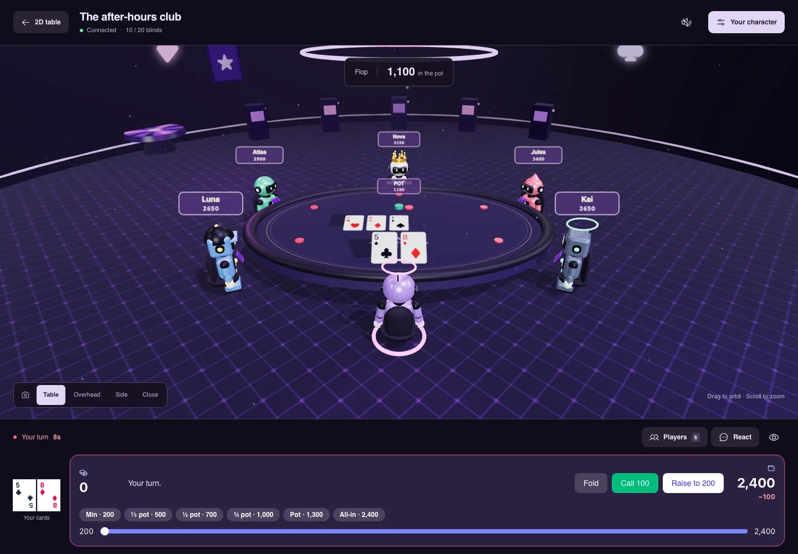
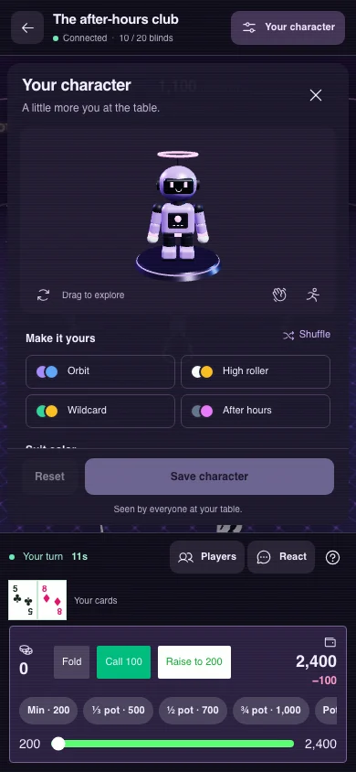

# 3D experience validation

The 3D lounge keeps the existing game state, guarded betting controls, saved avatar format, and multiplayer messages. Characters now have articulated suits, blinking faces, detailed accessories, and live pose previews. The wardrobe offers four presets, color choices, silhouettes, headwear, shuffle, reset, and save feedback. The HUD separates camera/social controls from betting, keeps private cards readable, and provides keyboard-accessible player targeting.

## Checks

- All workspaces typecheck.
- Web and server production builds pass. Vite retains its large Three.js chunk advisory; the 3D route is lazy loaded.
- All six web tests pass, including compatibility and malformed-avatar regression coverage.
- Impeccable detector: no findings across `apps/web/src`.
- Chromium browser checks with an isolated local room fixture: 1440×1000, 390×844, and 375×667. No production account, chip balance, or game was modified during these checks.
- Save failure displays an error; retry submits once and updates the local character. The existing server route was reviewed to confirm it broadcasts profile changes.
- Wave emits the expected emote message. Player selection and chip toss emit the expected target seat. Reactions and betting controls disable on disconnect.
- Camera presets work with reduced motion. Responsive camera framing was checked. Private cards stay readable in the HUD.
- Verified the default Cyber theme, including betting-text contrast and the open/hover character control.
- Short-screen wardrobe remains inside the viewport; mobile header/footer/action bounds fit the 390px viewport.
- Leaving the 3D route removes both canvases. Scene cleanup cancels animation frames/timers, removes emote listeners, and disposes geometry, materials, textures, and the environment target. Unchanged character rigs survive game-state updates.
- Forced WebGL failure displays a working 2D-table fallback.

## Existing test-suite issue

The full suite produced 199 passing assertions and one 5-second integration timeout while browser rendering was also active. The timed-out three-player showdown test passed on an isolated retry (2.79 seconds). Both runs still reported the existing `database connection is not open` async teardown errors (64 in the full run, three in the isolated run); consequently the full-suite command is not green. Server/game/test-harness files were not changed by this UI work.

Browser checks used the local software WebGL renderer. They establish rendered appearance and interaction behavior, not a frame-rate claim for physical phones or a production multiplayer end-to-end test.

